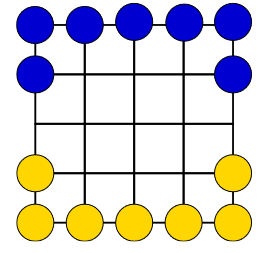

# boardgame-kadosa
[ 2.31. Feladat ]

A two player board game where each player tries to move all their pieces to the other side

Given the game board shown in the figure, one player has 7 blue discs and the other has 7 yellow discs. Players take turns moving their own disc diagonally to an adjacent empty grid point. Their goal is to get their discs to the grid points from which the opponent's discs started. The player who succeeds in getting all his discs to the opposite side of the board first wins.

